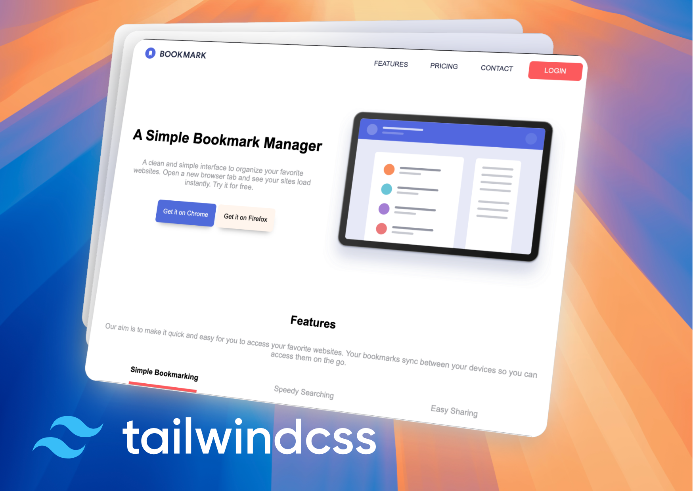

# Sprint 1 - IT Academy FrontEnd Course (Tailwind CSS aproach)

This first sprint aims to create a simple landing page using three diferent aproaches:
- Vanilla (HTML + CSS + JavaScript)
- Implementing SASS instead of vanilla CSS
- Implementing Tailwind instead of vanilla CSS

## 🛠️ Stack

As this is the Branch for the Tailwind aproach, the stack is:

- 📝 Native HTML
- 🔥 Tailwind CSS
- 💚 Native JavaScript
